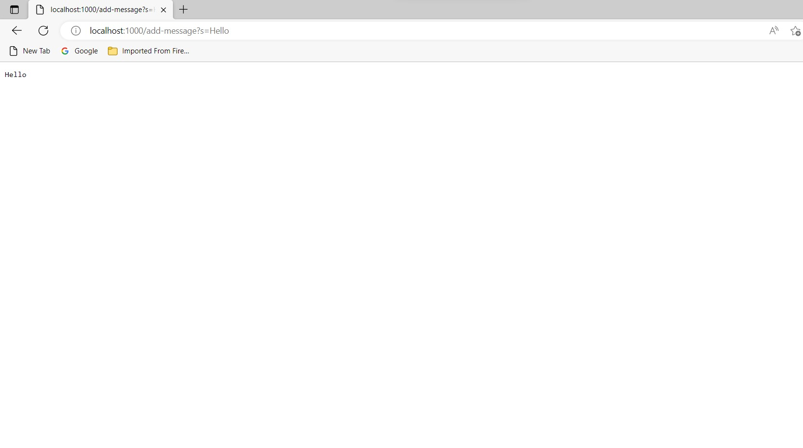
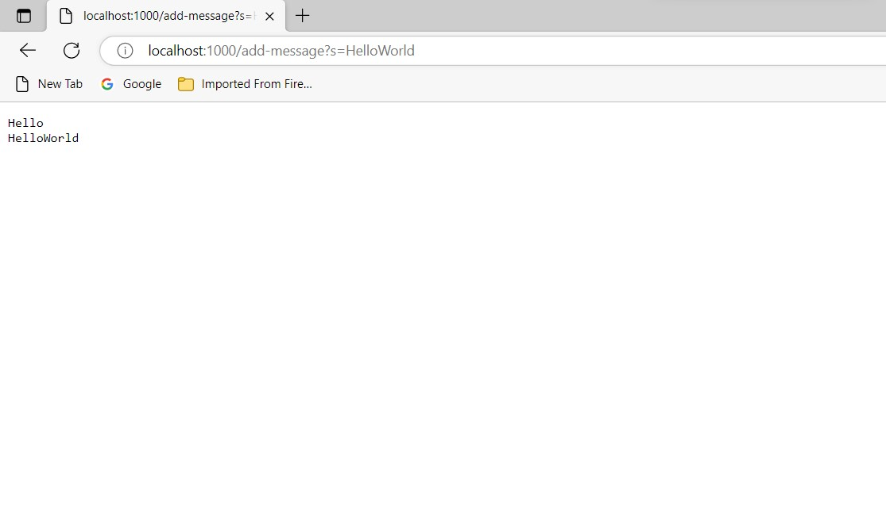

# -cse-15l-lab-report-week2
## Lab Report 2
### Part 1
Code for StringServer;
```
# code block
import java.io.IOException;
import java.net.URI;
import java.util.ArrayList;

class Handler implements URLHandler {
ArrayList<String> strings = new ArrayList<String>();


public String handleRequest(URI url) {
    String string = "";
    if (url.getPath().equals("/add-message"))
    {
        String[] parameters = url.getQuery().split("=");
        strings.add(parameters[1]);
        
        for (int i = 0; i < strings.size(); i++)
        {
    
           string += strings.get(i) + "\n";
        }
        return string;
    }
    return "Error";
}

class StringServer {
    public static void main(String[] args) throws IOException {
        if(args.length == 0){
            System.out.println("Missing port number! Try any number between 1024 to 49151");
            return;
        }

        int port = Integer.parseInt(args[0]);

        Server.start(port, new Handler());
    }
}
}
```
**Image 1:**

**1.** The server must be started first by the class StringServer, this is necessary for starting the server with a proper port. The next class is public StringHandleRequest, within this class several methods are used to find the desired string value to display on the server. We first use .getpath() to check if within the path there exist a "add-message" through the equals method. If this is true, we would then call the split method to split the query by the regex, in this case it 
is the "=". The add method is used to add the strings after the regex into the arrayList. A for loop runs thru this arrayList and we use .get to pull the
string values from the arrayList to display on the server.

**2.** The relevant field to the class is the url, we must first take a url to break down. For the path, we needed to have a path to first extract from and for this if condition to fall thru this path must have the string "add-message". For the next method, we need to make sure that there exist a regex of "=", this is the delimeter for isolating the string value we need. In the strings add method, we must have a argument of a string to add to the arrayList. This is done by adding the 1st value of the string parameter. After all values are added within our arrayList, we simply use the forloop and .get method to iterate through our arrayList and return each element within it.

**3.** I dont't think any value is changed since we are not changing values just simply extracting certain values to display within our server. Although much of the code we are isolating certain things within the url, the url still remains intact as the server url is the same even after running our code. Since this is the first time doing the add-message, the url remains intact and the string value is the exact string after the = sign.

**Image 2:**

**1.** Similar to the first image, the server must be started by class StringServer or none of this would be displayed. The class PublicStringHandleRequest also calls upon the same methods. It is isolating the url by its path, then spliting by the regex, the string value after the delimeter which is the equal sign is then added to the arrayList. A for loop is ran that will get the elements within this arrayList, which now stores the previous string as well as the current string.

**2.** Similar to the first image, the url is the relevant field for the class since thats where add-messages, delimeter as well as the string we hope to display is located. The get path method requires a path in this case the relevant string that .equals hopes to find is add-messages, the getQuery method requires a valid query. Split method requires the query to contain the regex "=". Everything remains the same for image 2 as image 1 as they both call upon similar methods as both must isolate for the string that needs to be displayed within the server.

**3.** I think the value is changed here. The url must be changed to add this new string. The server changes from http://localhost:1000/add-message?s=Hello to 
http://localhost:1000/add-message?s=HelloWorld. Only the value after the delimeter must be changed in this situation. The value Hello must be changed to HelloWorld in this situation to generate the above image. 

### Part 2
For this part I will use ***A failure-inducing input for the buggy program, as a JUnit test and any associated code***

**Here is the code for the associated test:**
This code hopes to change the input in reverse order
```
# code block
  static void reverseInPlace(int[] arr) {
    for(int i = 0; i < arr.length; i += 1) {
      arr[i] = arr[arr.length - i - 1];
    }
  }
```

**Here is the test associated with the failure inducing input:**
This code tests to see if the input is actually reversed
```
# code block
	public void testReverseInPlace() {
    int[] input1 = { 3 , 2 };
    ArrayExamples.reverseInPlace(input1);
    assertArrayEquals(new int[]{ 2, 3 }, input1);
	}
```
**Failure Inducing Test:** Using a array containing greater than 1 element, specific example {3,2}

**Bug:** Code iterates through the array, given the test array it has a length of 2. The for loop thus runs through and increments i to the length of the array. arr[0] = arr[2 - 0 - 1], which is arr[0] = arr[1]. Which means, arr[0]= 2. The next iteration goes to arr[1] = arr[2 - 1 - 1] arr[1] = arr[0]. It access the edited array of [2,2], given that the first element is now 2, the final out is [2,2,].

**Symptom:**  The expected output is {2,3} but the actual output is {2,2}

Now to fix this issue, 

```
# code block
  static void reverseInPlace(int[] arr) {
    for(int i = 0; i < arr.length -1; i += 1) {
      int temp = arr[i];
      arr[i] = arr[arr.length - i - 1];
      arr[arr.length - i - 1] = temp;
    }
  }
```

The code still uses a for loop, however arr.length is subtracted by 1. We should not iterate through the entire arrayList as say a length of 2 means there are two elements with indexes between 0 and 1. If we iterate it to 2 it would cause an issue because there is no index of 2 within a array of length 2. The next thing is creating a temporary holder variable to hold the int values. It will hold the values of each index of the array. The value of arr[i] would then equal the the size of arr.length-i-1. So the first stored value of arr[i] = arr[0] and the next stored value would be arr[1]. These values are then reversely stored into temp allowing the new array to be in the order of arr[1],arr[0]. Completeing the reversal.

### Part 3
Something I learned in Week 3 was how to essentially check the entirety of the actual output. 

The default code that was given was;
```
# code block
assertArrayEquals(new int[]{ 2, 3 }, input1);
```
Although this code works and does tell you if the expected output and the actual output is equal,
it only shows the indexes of where the difference occurs. This is not very helpful, since it does
not cover the broader view of where the bugs or errors could have occured at. However, if you used
toString() it can help show the entire actual output so you can see in the broader sense of where
the code could have occured.

Instead using this code;
```
# code block
assertEquals(Arrays.toString(new int[]{2,3}), Arrays.toString(input1));
```
The entire actual output is displayed, the toString method basically converts both expected output
and actual output to a string. This way when comparing the two, the entirety of the actual output 
is revealed.
